# `{{USERNAME}}`

<p align="center">
  
</p>

<p align="center">
	
</p>

```bash
$ uname -a
Linux github-profile x86_64 rolling

$ whoami
{{USERNAME}}

$ date -u
{{DATE}}
```

## Contact

```bash
$ links
linkedin  -> https://linkedin.com/in/your-linkedin-handle
instagram -> https://instagram.com/your_instagram
gmail     -> mailto:your.email@gmail.com
```

## About

```bash
$ cat about.txt
- Final-year Software Development Technology student.
- International exchange scholar at TAMK (Finland).
- Focused on full-stack, cloud architecture, and cross-platform apps.
- Experience delivering IoT and agricultural automation R&D solutions.
```

## Tech Stack

[](https://docs.python.org/3/)
[](https://docs.djangoproject.com/)
[](https://flask.palletsprojects.com/)
[](https://developer.mozilla.org/docs/Web/JavaScript)
[](https://react.dev/)
[](https://nextjs.org/docs)
[](https://nodejs.org/docs/latest/api/)
[](https://docs.flutter.dev/)
[](https://dart.dev/guides)
[](https://www.postgresql.org/docs/)
[](https://dev.mysql.com/doc/)
[](https://www.mongodb.com/docs/)
[](https://docs.docker.com/)
[](https://docs.aws.amazon.com/)
[](https://firebase.google.com/docs)
[](https://docs.oracle.com/en/java/)
[](https://en.cppreference.com/w/)

## Dynamic Stats

```bash
$ gh profile stats
repos={{REPOS}} | stars={{STARS}} | commits={{COMMITS}} | followers={{FOLLOWERS}}
```

---

> _This README is auto-updated every 24 hours using GitHub Actions._
